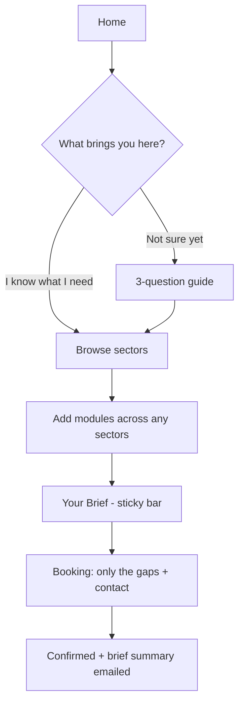

# Harmony Club House — Workflow Redesign

Not a patch of the current site. A rethink of how a visitor moves from "who are these people"
to "here's exactly what I need, book me in."

---

## Why the current flow doesn't work

The site is built on an assumption that doesn't match the business.

**The site assumes:** a visitor picks *one* sector, reads about it, and contacts you.
**Reality:** a customer picks *any combination* of services — some of one sector, all of
another, sometimes across sectors — and rarely wants the full package.

Everything that feels wrong follows from that mismatch:

1. **The visitor has to navigate your org chart.** Home → Service → a hero for a sub-division →
   "Four Pillars" grid → an info page. To find what they want, they must first understand how
   *you* are structured internally. The labels don't even agree with each other — "Division",
   "Department", "Specialized Division", "Pillars", plus Catering floating as a fifth thing
   under a heading that says there are four.

2. **Sector pages are dead ends.** Each one describes capabilities and stops. There's no way to
   say "I want *this* and *this*." The visitor's intent — the most valuable thing they have — is
   discarded on every page.

3. **Choice is collapsed at the very last step into a single-select dropdown.** The contact form
   makes you choose one service from a list. A customer who wants furniture + recipes + staff +
   the ordering app has no way to express that, so they write a vague message or leave.

4. **Nothing accumulates.** Reading four pages leaves you exactly where you started.

The fix is to make the site work the way the product works: **modular, additive, and
cross-sector.**

---

## The proposed workflow

### Core mechanic: "Your Brief"

Every individual service on the site is a selectable module with an **Add** toggle. Selections
persist as the visitor moves around. A slim sticky bar shows what they've picked and offers one
action: book the appointment.

Why this is the right mechanic here:

- **Multi-select is native**, across sectors, exactly matching how you actually sell.
- **No dead ends.** Every page has a next action.
- **The booking form gets shorter, not longer.** The *what* is already captured, so the form only
  asks the gaps.
- **You receive a real brief** — "site selection + furniture + recipes + staffing, opening in
  March, Cairo" — instead of "hi, I'm interested."
- **No competitor site does this.** Agency sites are brochures. This is a differentiator.

Do **not** call it a cart and do **not** show prices — that cheapens a premium consultancy.
"Your Brief" reads as consultative: you're assembling the agenda for a meeting.

### Entry: intent, not org chart

Replace the org-chart entry with the customer's own mental model. Three doors on the home page:

- **"I'm opening something new"** → Business Development, F&B app, Marketing, Recruitment
- **"I'm already running a business"** → Ops improvement, Marketing, F&B app, Recruitment, Training
- **"I'm hosting an event"** → Events, Catering *(the only door open to individuals)*

The five sectors still exist as pages — this is an additional way in, for visitors who know
their problem but not your structure. Sector pages stay directly reachable from the nav.

### Booking: progressive, short, last

Contact details come **last**, after the visitor has invested in selecting. Asking for a name
first is the single biggest drop-off cause. The form asks only what the selection doesn't
already tell you — typically 3–5 questions — then name, email, phone, preferred time.

---

## The content model

This is the foundation — every module below is independently selectable. Build this list first;
the UI is downstream of it.

### Business Development — turnkey restaurant creation
Site selection & scouting · Feasibility study & concept · Interior design · Furniture & fit-out ·
Kitchen design & equipment · Menu & recipe development · Staffing & hiring · Operations setup &
SOPs · **Full turnkey** (selects all)

*Gap questions:* new or existing · concept type · location status (signed / shortlisted / not
yet) · target opening date · city

### Events — the only sector open to individuals
Full event production · Catering · Venue sourcing · Décor & centerpieces · Stage & technical
(AV, lighting, sound) · Event staffing · Entertainment booking · Guest management

*Gap questions:* company or individual · event type (wedding, corporate, annual celebration,
concert, exhibition, other) · date + flexibility · guest count · venue status

### Marketing — "Marketing Recipe"
Brand identity · **Experiential touchpoints** · Social media management · Reels & video ·
Photography · Influencer & PR · Launch campaign

*Gap questions:* existing brand identity (yes / no / needs refresh) · goal · current social
handles

### Recruitment & Training
Talent acquisition · Interviewing & assessment · Executive placement · Chef & culinary sourcing ·
FOH / BOH staffing · Seasonal & event staffing · Training programs · Labor analysis

*Gap questions:* roles + headcount · urgency · location

### F&B Division — the ordering app *(missing from the site entirely today)*
Table-side QR ordering · Online payment · Pickup ordering · Delivery · POS integration ·
Branded customer app

*Gap questions:* venue type · number of branches · existing POS · timeline

---

## Marketing: how to make it land

Your open question. Recommendation: stop selling "marketing services" and sell **the guest
moment**.

Keep the name **Marketing Recipe** — it's already on-brand — and build the page as an actual
recipe: **Ingredients** (the modules above) and **Method** (how you run it). Open with the
chocolate-spoon story told concretely — the ice cream, the spoon, what the guest feels — because
one specific detail sells harder than four capability cards saying "brand identity" and
"campaign management." Follow it with a **Moments gallery** of physical touchpoints you've built.

Position it as a **layer that attaches** to Business Development and Events, not a standalone
agency competing on price with every agency in Cairo.

---

## Content corrections carried over from the audit

Still true regardless of flow:

- **The F&B app is absent from the site.** What's labeled "Food & Beverage Division" today
  actually describes Business Development (kitchen design, menu engineering). Biggest gap.
- **Business Development is under-sold** — reads as "restructuring" rather than turnkey
  creation — and is called "Management Services" on its own page but "Business Development" on
  the card. One name.
- **Events misses its differentiators:** concerts absent, weddings buried, nothing about building
  from centerpiece to stage, and no signal that individuals are welcome.
- **Catering** contradicts the "Four Pillars" framing by appearing as a fifth division. In the
  new model it's simply a module inside Events.
- **Zero proof anywhere** — no project photos, client logos, or outcome numbers.

---

## Build order

| Phase | What | Why here |
|---|---|---|
| **1** | Content model — all modules as typed data | Everything else reads from this |
| **2** | Routing + split `App.tsx` (2,246 lines, every page in one file) | Can't build this flow inside one file safely |
| **3** | Brief state + sticky bar + Add toggles | The core mechanic |
| **4** | Booking flow (gap questions → contact → confirm) | Completes the loop |
| **5** | Sector pages rebuilt on modules: F&B app → Business Dev → Events → Marketing → Recruitment | F&B first: biggest gap |
| **6** | Intent entry on home page | Needs sector pages to exist |
| **7** | Proof layer — galleries, logos, numbers | Content-dependent |
| **8** | Wire submission to backend | Last: the flow defines what the API needs |

Phase 8 is last deliberately. The current backend's service-request endpoint is locked to
logged-in companies, so it can't take prospect bookings as-is — but there's no point shaping an
API before the flow that feeds it is settled.

---

## Open questions for you

1. Should a visitor be able to book **without** selecting anything ("just talk to someone")?
   Recommend yes, as a small secondary link — some buyers want a human immediately.
2. Do sectors ever get sold as a discounted bundle, or is it always priced per module?
3. For Events with individuals (weddings) — same booking flow, or does it need a softer,
   less corporate treatment?
